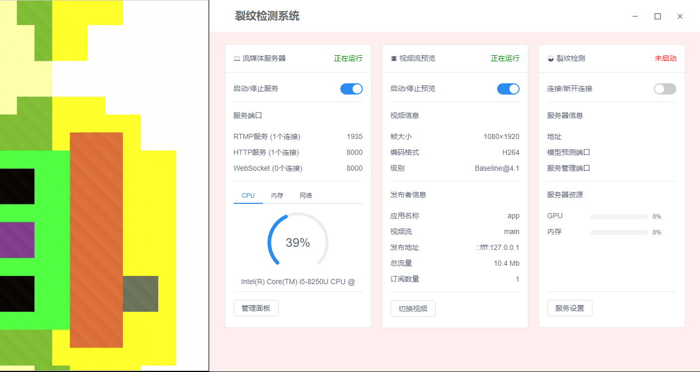
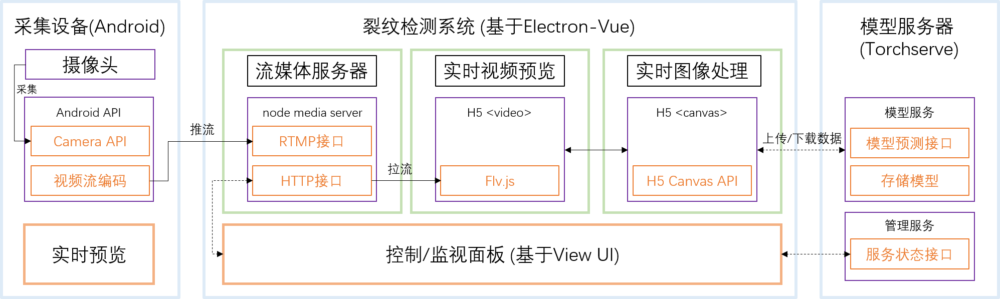

# 裂纹检测系统

裂纹检测系统，本项目基于 [electron-vue](https://github.com/SimulatedGREG/electron-vue) 创建



## 开始
请确保您已经安装 [Node.js](https://nodejs.org/en/) (版本大于7)以及 [yarn](https://yarnpkg.com/) 软件包管理器

安装相关依赖并调试程序
``` bash
yarn # or npm install
yarn run dev # or npm run dev
```
构建您的应用
``` bash
yarn run build # or npm run build
```

### Windows 用户
可以在此处 [下载](https://github.com/WangYf-zju/CrackDetectionSystem/releases) 软件安装包，请确保您已安装 [Node.js](https://nodejs.org/en/) (版本大于7)

## 系统架构
裂纹检测系统由采集设备，检测系统以及模型服务器三个部分组成，本项目为检测系统部分



* 采集设备：使用Android手机作为实时图像采集设备可参考 [CrackDetectionMobile](https://github.com/WangYf-zju/CrackDetectionMobile) 项目进行实时推流，您亦可通过其他软件使用 [支持的协议](https://github.com/illuspas/Node-Media-Server#features) 推流
* 检测系统：内置流媒体服务器，接收图像采集设备上传的视频流；上传实时图像到模型服务器进行预测并显示结果
* 模型服务器：使用 [TorchServe](https://github.com/pytorch/serve) 部署PyTorch模型，可参考 [快速搭建模型服务器](/docs/model_server_quick_start.md) 或TorchServe [官方教程](https://github.com/pytorch/serve)

## 项目使用框架
* [electron-vue](https://github.com/SimulatedGREG/electron-vue)：使用Vue构建Electron项目模板
* [View UI](https://github.com/view-design/ViewUI)：UI框架
* [flv.js](https://github.com/bilibili/flv.js)：视频流播放器
* [node media server](https://github.com/illuspas/Node-Media-Server)：流媒体服务器框架